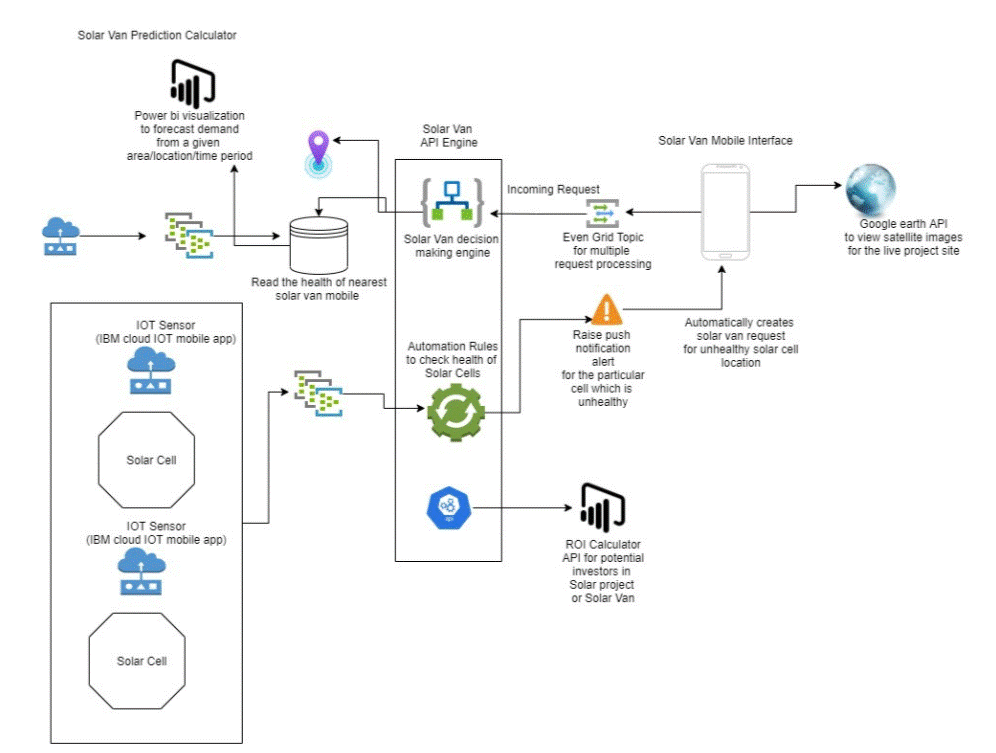
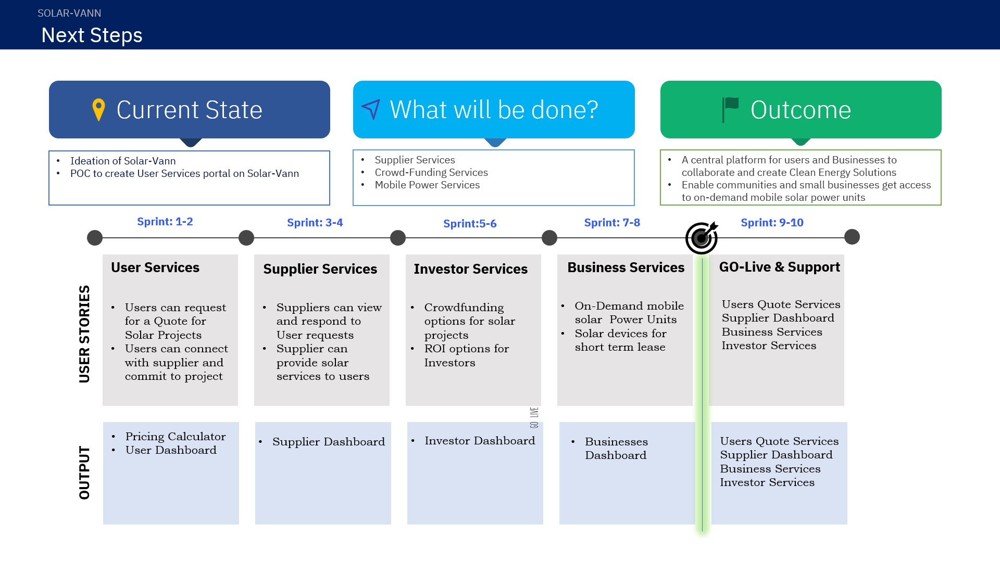

# solarVann
A common platform for solar providers and individuals to come together and create clean energy solutions for the community.

# Table of Contents
 - ### What is Solar-Vann?
 - ### A short demo
 - ### The Architecture
 - ### Components Used
 - ### Detailed Description
 - ### What Next?
 - ### How to get started?
 - ### How to Contribute?

# What is Solar-Vann?
   - ## The problem ?
     Solar solutions have been around for more than a decade now, yet urban and rural India is very dependent on the commond energy sources available in big cities and yet to fully embrace the alternative clean energy solutions. With new regulations by city corporations it has now become imperative to look at clean energy solutions. Yet this journey towards clean green energy sources is riddled with practical problems starting with heavy investment to finding the right provider who can support our needs to simply not being able to install it.
   
   - ## How can technology help ?
   A common platform for home owners/small businesses and providers alike in urban/rural localities to collaborate and find solutions to solve the energy needs using solar or hybrid solutions. From using mobile solar powered units for quick and short term usage to permanent solutions with the help of like minded investors to support these projects for the community at large.
   
   - ## The Idea
   A web/mobile based solution to allow users and service providers to connect. A means to locate mobile power units for short term needs and find crowd funding options to help setup your solar/hybrid projects. To support the larger community needs and contribute in improving your locality
   
# Demo Video

# The Architecture

# Components Used
- IBM Cloud IOT Platform
- IBM ???
- Logic App on Azure
- SQL Database on Azure
- Automation Runbook on Azure
# What next?

# How to get started ?

# How to Contribute ? 
